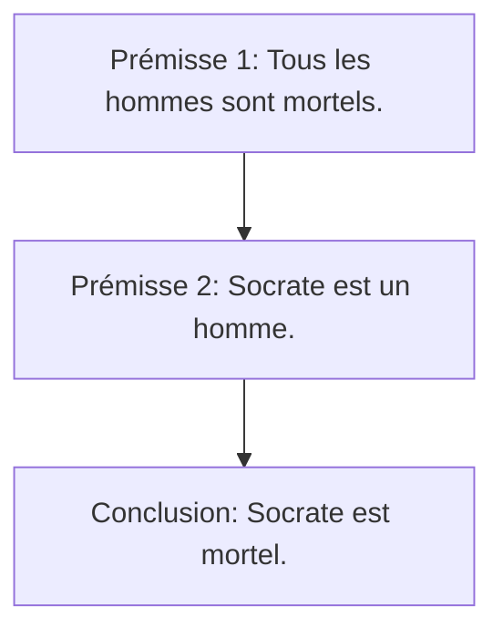
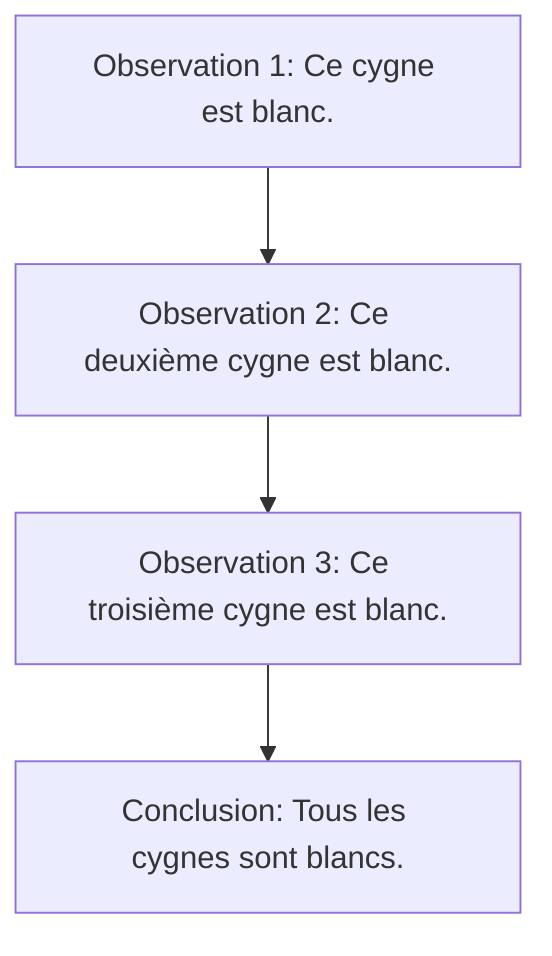

# Définition

## Étymologie

L'étymologie du mot "science" provient du latin **"scientia"**, qui signifie "connaissance", "savoir", "science", et "habileté". Ce terme est lui-même dérivé du verbe latin **"scire"**, qui signifie "savoir", "connaître".

Voici un découpage de l'étymologie :

- **"Scientia"** (latin) : Connaissance, savoir.
- **"Scire"** (latin) : Savoir, connaître.

## Significations

L'ensemble cohérent des connaissances relatives à des faits qui obéissent à des lois peut être désigné comme un **modèle pour la connaissance**. Grâce à la science, nous pouvons acquérir des savoirs fiables et systématiques.

### Savoir vs Croire

- **Savoir** : Se réfère à des connaissances que l'on peut justifier avec des preuves ou des arguments solides.
- **Croire** : Se réfère à des idées que l'on pense vraies, mais que l'on ne peut pas justifier de manière convaincante.

### Jugement sur le monde

Un jugement sur le monde consiste en un ensemble de propositions logiques qui visent à décrire et expliquer des phénomènes ou des faits observés.

## Raisonnement Déductif et Inductif

### Raisonnement Déductif

Le raisonnement déductif part de prémisses générales pour arriver à une conclusion spécifique. Les conclusions sont logiquement dérivées des prémisses.

### Raisonnement Inductif

Le raisonnement inductif part d'observations spécifiques pour arriver à des conclusions générales. Les conclusions sont probables **mais non certaines**. (Il existe des signes noirs)

# Références

![[3.29 Karl Popper#Karl Popper - Falsifiabilité]]

![[3.30 Francis Bacon#Francis Bacon - Méthode scientifique]]

![[3.12 Platon#Platon - L'allégorie de la caverne comme métaphore de l'ignorance et de la connaissance]]

# Sujets Courants

# Exemples

## Ajout de la constante cosmologique aux théories de la relativité générale

Einstein a introduit la constante cosmologique dans ses équations de la relativité générale pour obtenir un modèle statique de l'univers. Il a plus tard regretté cette décision, car il a découvert que l'univers était en expansion. Ce-ci est une hypothèse ad hoc, il l'a rajouté car ses équations ne permettaient pas de décrire un univers statique. Il a qualifié cette décision de "plus grande erreur de sa vie".

## Les axiomes des maths de Newton

Dans son opus magnum, "Principia Mathematica", Newton a posé des axiomes pour les mathématiques, c'est la théorie des ensembles.

Les axiomes sont essentiels pour établir des théories scientifiques cohérentes et vérifiables. En science, les axiomes permettent de poser des hypothèses fondamentales qui peuvent ensuite être testées et validées par l'expérimentation. Ils fournissent un cadre théorique à partir duquel des prédictions peuvent être faites et vérifiées empiriquement.
