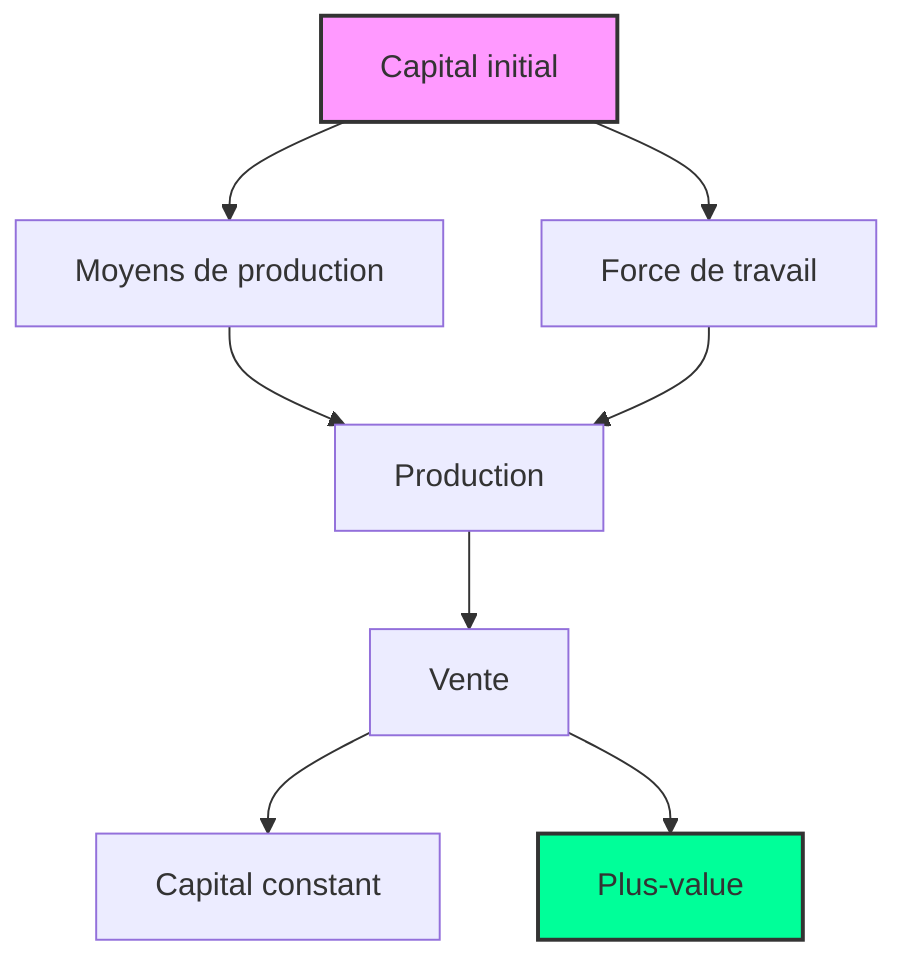

# Informations sur penseur

## Biographie

**Date de naissance** : 5 mai 1818  
**Lieu de naissance** : Trèves, Prusse (aujourd'hui Allemagne)  
**Date de décès** : 14 mars 1883  
**Lieu de décès** : Londres, Royaume-Uni

## Vie et Formation

- **Enfance et Éducation** : Né à Trèves, Marx était issu d'une famille de neuf enfants. Son père, Heinrich Marx, était un avocat converti au luthéranisme pour éviter l'antisémitisme. Marx a étudié à l'Université de Bonn en 1835, puis à l'Université de Berlin où il s'intéressa à la philosophie sous l'influence des Jeunes Hégéliens.
- **Début de Carrière** : Après l'obtention de son doctorat en 1841 de l'Université de Iéna, Marx devint rédacteur en chef de la _Rheinische Zeitung_, un journal libéral de Cologne. Cependant, le journal fut interdit par le gouvernement prussien en 1843, poussant Marx à s'exiler à Paris.
- **Activités Révolutionnaires** : À Paris, Marx rencontra Friedrich Engels, avec qui il développa une collaboration intellectuelle fructueuse. Ensemble, ils rédigèrent _Le Manifeste du Parti Communiste_ en 1848. Expulsé de plusieurs pays pour ses idées radicales, Marx s'installa finalement à Londres en 1849.
- **Travaux Principaux** : À Londres, Marx écrivit la majeure partie de son œuvre majeure, _Das Kapital_, une analyse critique du capitalisme. Il travailla également comme correspondant pour le _New York Daily Tribune_. Marx a consacré sa vie à l'étude des structures économiques et sociales, et à la promotion du communisme.
- **Dernières Années** : Marx vécut dans la pauvreté relative pour le

# Citations

> **Ce n'est donc pas la conscience des hommes qui détermine leur être ; c'est, inversement, leur être social qui détermine leur conscience**. - _Karl Marx_

^3a05a1

Hello w

# Idées

## Karl Marx - La conscience dépend de la société

Karl Marx considère la conscience non pas comme un phénomène purement individuel ou transcendantal, mais comme profondément ancrée dans les conditions matérielles de la vie. Selon Marx, c'est l'existence sociale des individus qui détermine leur conscience, et non l'inverse. Dans sa célèbre thèse sur Feuerbach, il affirme que [[3.07 Karl Marx#^3a05a1|l'être social qui détermine la conscience]]. Marx soutient que les idées, croyances et valeurs des individus sont le produit des relations économiques et sociales dans lesquelles ils vivent. En d'autres termes, la conscience est façonnée par les conditions matérielles et les structures de pouvoir de la société. Cette perspective matérialiste de la conscience contraste fortement avec les approches idéalistes, en mettant l'accent sur l'importance des réalités économiques et des relations sociales dans la formation des idées et des consciences individuelles.

## Karl Marx - Critique du droit naturel

Plusieurs penseurs comme [[3.18 Leo Strauss.md|Leo Strauss]], [[3.15 John Locke.md|John Locke]] ou [[3.14 Jean-Jacques Rousseau.md|Rousseau]] ont développé des théories sur le droit naturel, qui postulent l'existence de principes éthiques et moraux universels qui transcendent les lois et les normes culturelles. Cependant, **Karl Marx adopte une position critique à l'égard du droit naturel.**

Marx soutient que le droit est un instrument de domination et d'exploitation utilisé par la classe dominante pour maintenir son pouvoir sur les classes subalternes. Il voit le droit comme un moyen de légitimer les inégalités économiques et sociales inhérentes au capitalisme, en protégeant la propriété privée et les intérêts des capitalistes au détriment des travailleurs.

## Karl Marx - Le travail est l'essence de l'humanité

Pour Marx, **le travail est une activité fondamentale qui définit l'essence de l'humanité**. C'est par le travail que les individus transforment la nature et produisent les biens nécessaires à leur survie. **C'est ce qui nous distingue des autres espèces animales** et nous permet de façonner notre environnement pour répondre à nos besoins.

Les animaux donnent l'impression de travailler, mais en réalité **leur travail est instinctif** et ne vise pas à transformer leur environnement de manière consciente. L'homme, en revanche, **travaille de manière consciente et créative**, en utilisant sa capacité de pensée et de réflexion pour produire des biens et des services qui améliorent sa condition.

## Karl Marx - Le travail est détourné par le capitalisme

Dans le système capitaliste, les travailleurs sont contraints de **vendre leur force de travail** aux capitalistes pour un salaire, tandis que les capitalistes s'approprient la plus-value produite par les travailleurs.  On détourne le travail qui est l'[[3.07 Karl Marx#Karl Marx - Le travail est l'essence de l'humanité|l'essence même de l'Homme.]]

Cette relation d'**exploitation** crée une division entre les travailleurs et les moyens de production, les privant du contrôle sur leur propre travail et de la valeur qu'ils produisent.

La **plus value** est la valeur ajoutée par le travailleur qui n'est pas rémunérée par le capitaliste. C'est la source des profits capitalistes.

La **bourgoisie** est la classe dominante qui possède les moyens de production, tandis que le **prolétariat** est la classe ouvrière qui vend sa force de travail.

## Marx - la religion est l'opium du peuple

Karl Marx considère la religion comme "l'opium du peuple". Il soutient que la religion sert à masquer la misère et l'exploitation des hommes, agissant comme une drogue qui atténue la douleur sans résoudre les causes de la souffrance. Ainsi, la religion devient un instrument de domination utilisé par les classes dirigeantes pour maintenir leur pouvoir.